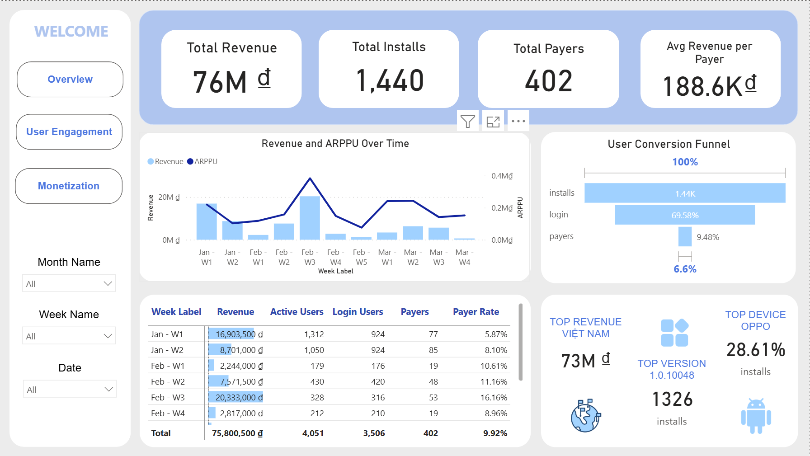
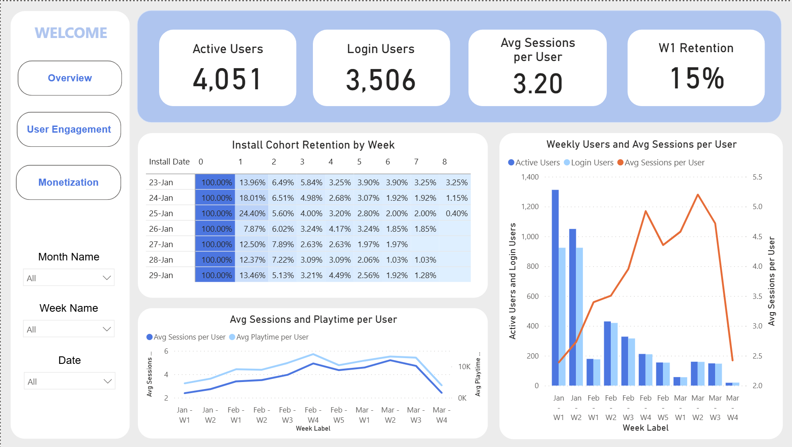
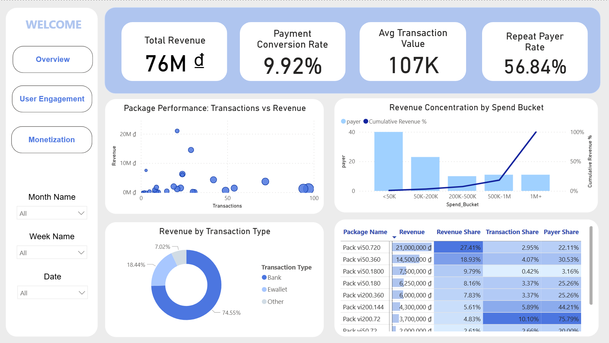

# Game User Lifecycle Dashboard

## Giới thiệu
Project phân tích toàn bộ user lifecycle trong game, từ **install → login → play/session → retention → payer → revenue**.  
Mục tiêu là theo dõi hiệu quả kinh doanh, xác định bottleneck trong hành vi người dùng và tìm cơ hội tối ưu retention, conversion và revenue.

**Công cụ sử dụng:** SQL Server, Power BI, Slides

---

## Bài toán
Project tập trung trả lời 3 câu hỏi chính:
- User rơi nhiều nhất ở bước nào trong lifecycle?
- Retention và engagement sau khi vào game đang ở mức nào?
- Doanh thu đến từ đâu và có đang phụ thuộc vào một nhóm user/package hay không?

---

## Cách thực hiện
- Audit dữ liệu để kiểm tra datatype, null, duplicate, outlier và mapping key
- Làm sạch dữ liệu bằng SQL
- Xây dựng staging tables và các bảng phân tích
- Thiết kế dashboard trên Power BI để theo dõi funnel, retention, engagement và monetization

Một số vấn đề dữ liệu được xử lý:
- dòng null thừa trong `install_logs`
- duplicate trong `progression_logs`
- outlier `engagement_time_sec > 86400` trong `session_logs`
- mapping chưa 1-1 giữa `user_id` và `gamota_user_id`

---

## Cấu trúc dữ liệu chính
- **`bridge_user_account`**: nối dữ liệu hành vi với dữ liệu thanh toán
- **`dim_users_infor`**: thông tin tổng hợp theo user
- **`fact_daily_metrics`**: chỉ số business theo ngày
- **`fact_daily_engagement`**: chỉ số engagement theo ngày
- **`funnel`**: theo dõi chuyển đổi qua từng bước lifecycle
- **`cohort`**: phân tích retention theo cohort
- **`fact_daily_transaction`**: phân tích doanh thu và giao dịch

> **[Data model]**: Data model / relationship view

---

## Dashboard
Dashboard gồm 3 phần chính:
- **Overview**: KPI tổng quan, revenue trend, funnel
- **User Engagement**: active users, session, playtime, retention, cohort
- **Monetization**: revenue theo package, nhóm chi tiêu, phân bổ doanh thu

> **[Chèn ảnh]**
> 
> 
> 

---

## Insight chính
- Revenue có phát sinh nhưng tăng trưởng chưa bền vững
- Tỷ lệ **install → login** khá tốt, khoảng **70%**
- Mức giảm mạnh nhất nằm ở bước **login → payer**
- **Retention tuần đầu thấp** và giảm nhanh ở các tuần sau
- Doanh thu tập trung vào một số package giá trị cao và nhóm user chi tiêu lớn

---

## Đề xuất
- cải thiện **early retention**
- tối ưu **first purchase conversion**
- chăm sóc nhóm **payer giá trị cao**
- đa dạng hóa package để giảm phụ thuộc doanh thu

👉 [Xem báo cáo mẫu chi tiết](https://canva.link/co3uerpuuqfhyuj)
---

## Kỹ năng áp dụng
- SQL data cleaning và transformation
- xây dựng staging / fact / dimension tables
- phân tích funnel, retention, engagement, monetization
- thiết kế dashboard bằng Power BI
- chuyển dữ liệu thành insight và đề xuất business
